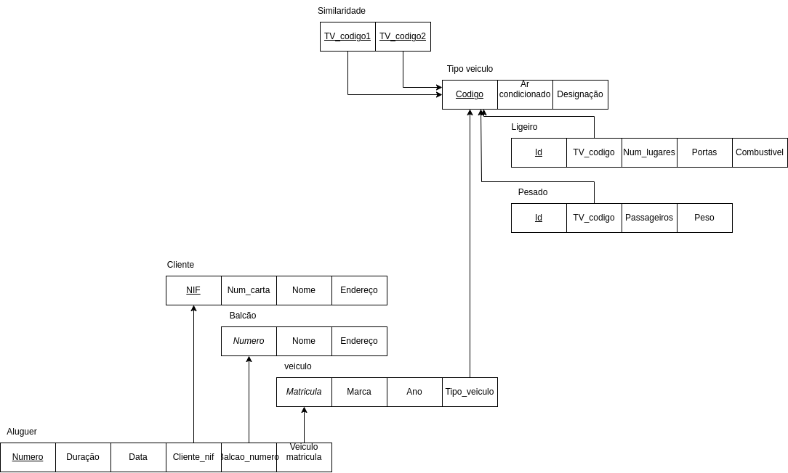
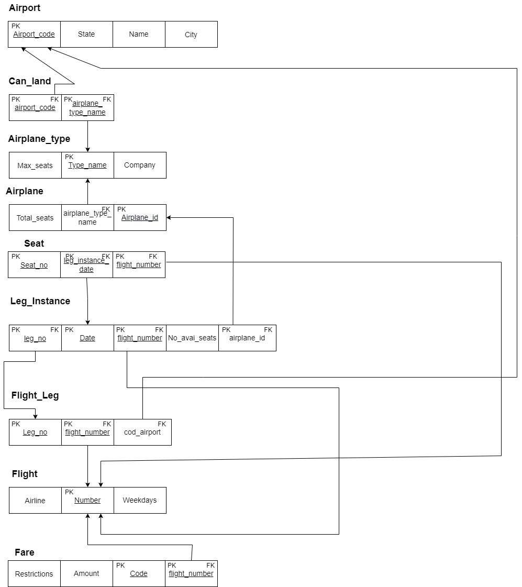
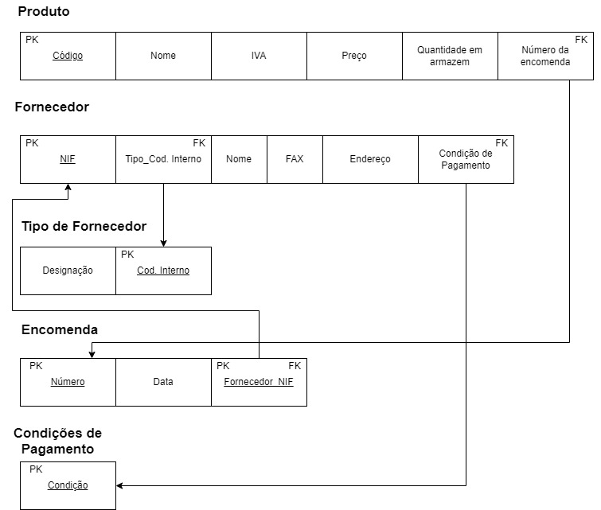
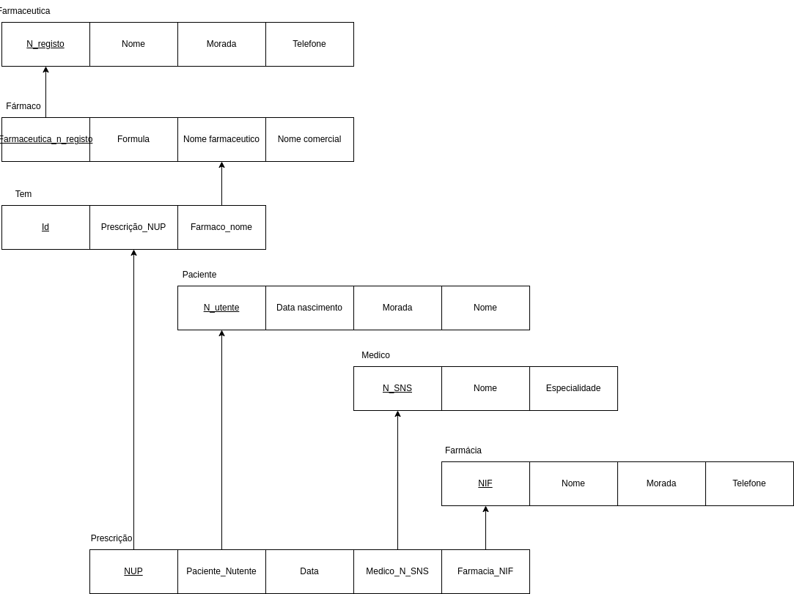
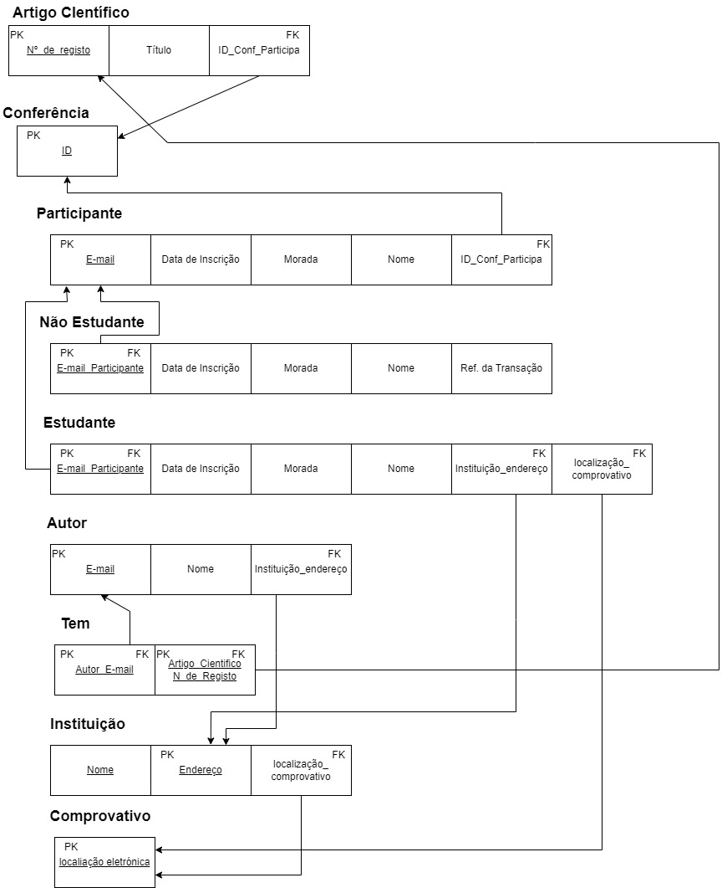
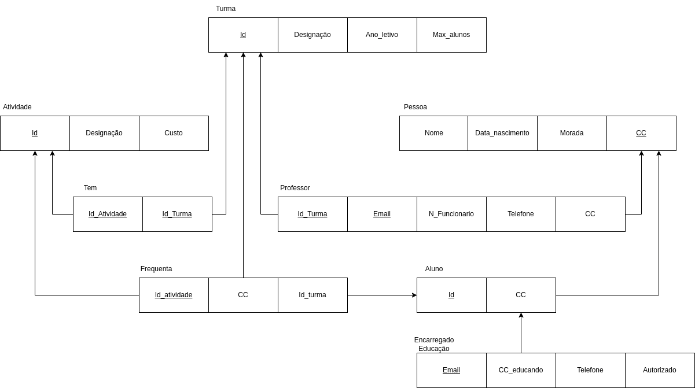

# BD: Guião 3


## ​Problema 3.1
 
### *a)*

```
Cliente: nif, nome, endereço, num-carta
Balcão: nome, número, endereço
Veiculo: matricula, ano, marca, tipo_veiculo_codigo
Aluguer: numero, duração, data, cliente_nif, balcão_numero, veiculo_matricula
TipoVeiculo: código, designação, arCondicionado
Similaridade: TV_codigo1, TV_codigo2
Ligeiro: Id, TV_codigo1, num_lugares, portas, combustivel
Pesado: Id, TV_codigo2, peso, passageiros
```


### *b)* 

```
Cliente
Chaves Candidatas: num_carta, nif
PK: nif
FK: --

Balcao
Chaves Candidatas: nome
PK: nome
FK: --

Aluger
Chaves Candidatas: número, cliente_nif, balcao_numero, veiculo_matricula
PK: número
FK: cliente_nif, balcão_numero, veiculo_matricula

Veículo
Chaves Candidatas: matrícula, tipo_veiculo_código
PK: matrícula
FK: tipo_veiculo_código

Tipo_veiculo
Chaves Candidatas: código
PK: código
FK: --

Ligeiro
Chaves Candidatas: Id, tipo_veiculo_código
PK: Id
FK: tipo_veiculo_código

Pesado
Chaves Candidatas: Id, tipo_veiculo_código
PK: Id
FK: tipo_veiculo_código

Similaridade
Chaves Candidatas: tipo_veiculo_codigo1, tipo_veiculo_codigo2
PK/FK: tipo_veiculo_codigo1, tipo_veiculo_codigo2
```

### *c)* 




## ​Problema 3.2

### *a)*

```
###Airport
| <u>Airpot_code</u> | City | State | Name |

###Airplane_Type
| Company | <u>Type_name</u> | Max_seats |

###Airplane
| <u>Airplane_id</u> | Total_no_of_seats | <span style="text-decoration: underline dashed;"> airplane_type_name </span> |

###Flight
| <u>number</u> | airline | weekdays |

###Seat
<u> Seat_no </u> | <span style="text-decoration: underline dashed;"> flight_number </span> | <span style="text-decoration: underline dashed;"> Leg_Instance_date </span> |

###Leg_Instance
| <u>Date</u> | No_of_avail_seats | <span style="text-decoration: underline dashed;"> flight_number </span> | <span style="text-decoration: underline dashed;"> airplane_id </span> | <span style="text-decoration: underline dashed;"> flight_leg_no </span> |

###Flight_Leg
| <span style="text-decoration: underline dashed;"> flight_number </span> | <u>Leg_number</u> | <span style="text-decoration: underline dashed;"> airport_code </span> | 

###Fare 
| <u>code</u> | amount | <span style="text-decoration: underline dashed;"> flight_number </span> | restrictions |

###Can_land
| <span style="text-decoration: underline dashed;"> airport_code </span> | <span style="text-decoration: underline dashed;"> airplane_type_name </span> |
```

### *b)* 

```
###Airport
PK: Airport_code
CK: Name

###Airplane_Type
PK: Type_name

###Airplane
PK: Airplane_id
FK: air_plane_type_name

###Flight
PK: number

###Seat
PK: Seat_no
FK: flight_number, Leg_Instance_date

###Leg_Instance
PK: Date
FK: flight_number, airplane_id, flight_leg_no

###Flight_Leg
PK: Leg_number
FK: flight_number, airport_code

###Fare
PK: code
FK: flight_number

###Can_land
FK: airport_code, airplane_type_name
```

### *c)* 




## ​Problema 3.3


### *a)* 2.1



### *b)* 2.2



### *c)* 2.3



### *d)* 2.4


