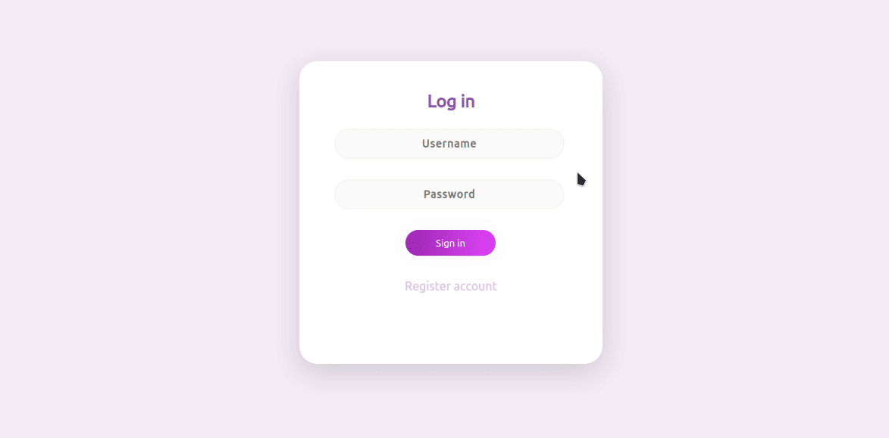
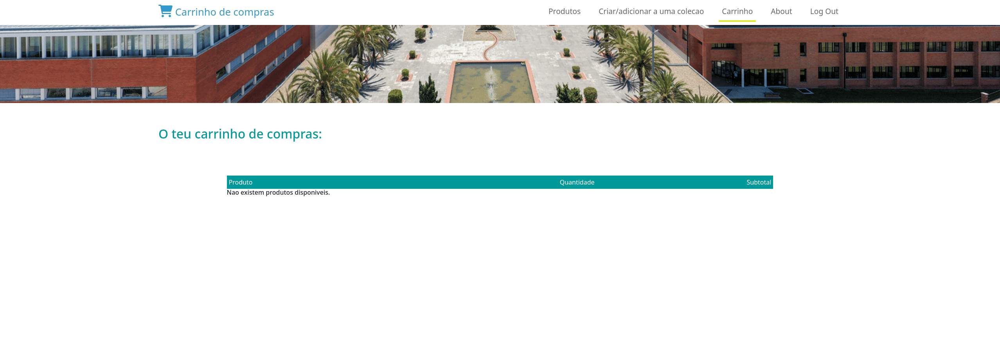
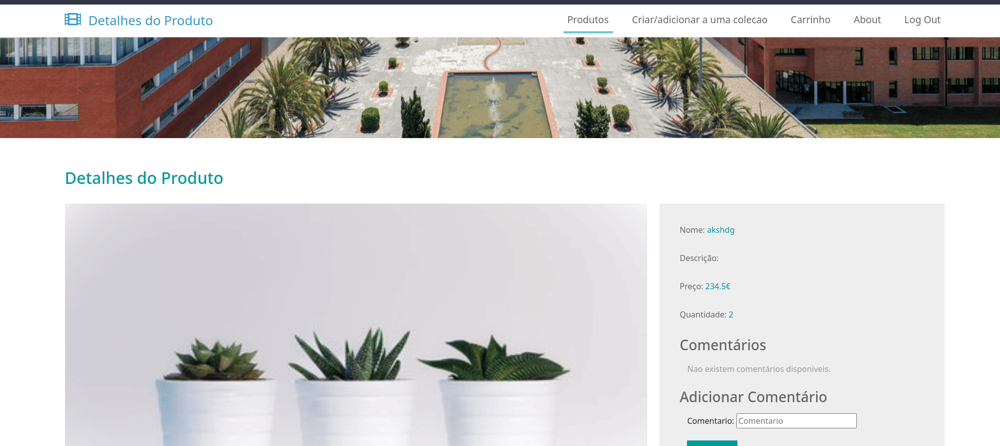
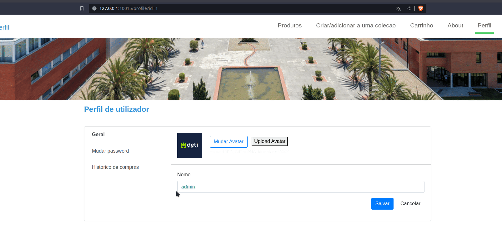
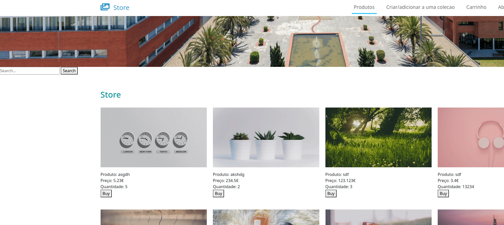
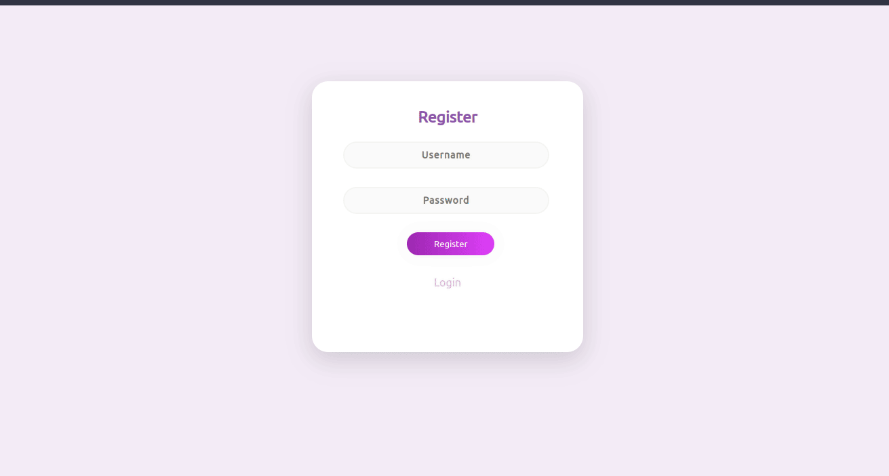
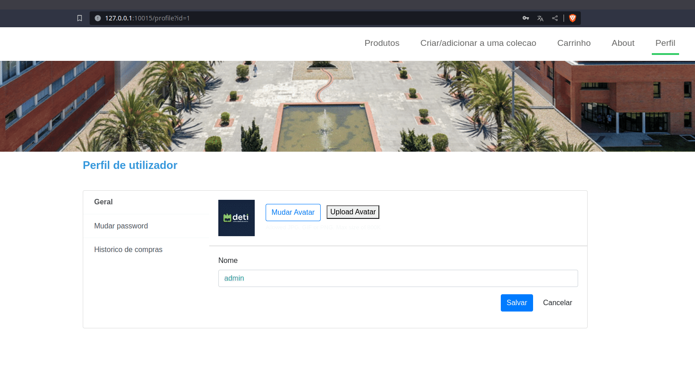

# SIO Project

### First Delivery


---

## Index

1. Introduction

2. Overview

3. Vulnerabilites

- CWE-89
- CWE-352
- CWE-79
- CWE-522
- CWE-311
- CWE-521
- CWE-1393
- CWE-620

4.  Extra Vulnerabilities

- CWE-434
- CWE-488 

5.  Conclusion
---

## 1. Introduction
In an era characterized by the digital world, websites have become the backbone of businesses and organizations. They serve as the virtual storefronts, communication hubs, and data repositories that drive the modern economy. However, this increased reliance on websites has also made them prime targets for a wide array of security threats. From data breaches and cyberattacks to malicious software and unauthorized access, the stakes for maintaining robust website security have never been higher.

With this project we aim to get a better understanding of the current state of website security, highlighting the various threats that website face in the digital landscape.

In the pages that follow, we will explore the most common security threats using the first implementation of our website witch presents a lack of security mesures and analyze the consequences of breaches, and then present a solution to these problems by using our secure version of the website that follows a good set of website security practises. 


## 2. Overview

To implement this website we used python with cherrypy and SQLite3 for the backend; HTML, CSS and Boostrap with a template for the frontend.

---

## 3. Vulnerabilites

### CWE-89: Improper Neutralization of Special Elements used in an SQL Command ('SQL Injection')

#### Vulnerability Explanation

The problem of a SQL injection occurs when an attacker inserts SQL statements in a form input box and that input is not validated by the server.

Client-side validation is easy to bypass by just doing the request manually using a tool like curl or with the help of more advanced tools as Burpsuite.

Usually, data given to the server is used in SQL statements in the server to, in this case, authenticate the client and give him access to his personal information and perform the desired actions.

However, when these parameters given to the server and not validated and are used directly in the SQL statement against the database (without proper escaping the string or ideally, using prepared statements), the attacker may be able to query the database for information he should not be able to get access to, potencially allowing attackers to get access to personal information of other users or dump the entire database.

This level of information and control over a server could be very destructive as it poses the risk of data leaks or even total system control if the data in the database is really sensitive.

#### Exploitation

In the case of our vulnerable web app, sqli injection is possible in the login form (and other parts of the website).

To exploit this flaw we only need to escape the username input field in the SQL query and and give it a statement that always returns true, allowing the attacker to login as the user with id 1, in this case, the admin.

Code snippet:
```sql
' or 1=1 --
```

###### Demonstration



#### Prevention

To prevent this type of attack we need to protect the statements used in the backend to query the database using prepared statements like so:

```python
db = sql.connect("database.db")
user = db.execute("SELECT * FROM Users WHERE user = ?", (name,)).fetchall()
```

Original vulnerable code:

```python
db = sql.connect("database.db")
user = db.execute("SELECT * FROM Users WHERE user = '" + name + "';").fetchall()
```

### CWE-352: Cross-Site Request Forgery (CSRF)

#### Vulnerability Explanation

This type of web app flaw can be seen as lack of control of who can use or request something from a website.

When a website is implemented, it should restrict the domains that can send requests (specially authenticated ones) to the web server, if it does not do so, an attacker could build a phishing/scam website that tries to replicate the original and trick the user into opening it getting compromised on the original site through some requests leading to data exposure, leaks or evene money loss depending on the type of website that has this vulnerability.

#### Exploitation

In the case of our website, CSRF is present in at least the cart page where an attacker can add products to another user's cart like so:

###### Demonstration



#### Prevention

To prevent CSRF, the most common solution is to use anti-CSRF tokens.
Anti-CSRF tokens are related pairs of tokens given to users to validate their requests and prevent issue requests from attackers via the victim. Each token contains a unique, unpredictable (randomly generated), secret value that is not guessable by a third party and thus, making it more difficult or impossible for an attacker to exploit this vulnerability.

Set the csrf token:

```python
csrf_token = str(binascii.hexlify(os.urandom(32)).decode())
cursor = db.cursor()
cursor.execute("UPDATE Users SET csrfToken = ? WHERE token = ?", (csrf_token, token))
dic = {"quantity": quantity, "name": name, "price": price, "size": len(quantity), "path": path, "id": id, "csrfToken": csrf_token}
```

Check if the token is valid:

```python
db = sql.connect('database.db')
user_csrf_token = db.execute("SELECT csrfToken FROM Users WHERE token = ?", (token,)).fetchall()
if user_csrf_token != []:
    user_csrf_token = user_csrf_token[0][0]

    # check if tokens match
    if user_csrf_token != csrfToken:
        db.commit()
        db.close()
        return json.dumps({})
else:
    db.commit()
    db.close()
    return json.dumps({})
```

### CWE-79: Improper Neutralization of Input During Web Page Generation ('Cross-site Scripting')

#### Vulnerability Explanation

This type of attack is based on injecting javascript code into the webpage meaning, it will run in the user side, with all the permissions, data and coockies that the user has on its browser possibly being very destructive to the website itself or even to the data of other websites that the user is logged in into if they are vulnerable to CSRF.

To exploit this type of vulnerability, attackers need to find an input field that does not validate the dat given to it, specifically, javascript.

Once injected, this malicious code can either be stored in the server (persistent XSS) or "reflected" to the user in the HTML itself (reflected XSS).

In this project, we are going to be looking at persistent XSS.

#### Exploitation

In our web app, once we are logged in, we may click in a product to see its details and open a page where we can comment about that specific product.

This input box is vulnerable to persistent XSS and exploiting it is as easy as doing something like:
```html
</img>
```

This will result in a comment in the database for the given product with the provided code and when any user navigates to this page, he will see a popup saying "1".

This example could be made to be a lot more damaging like ordering something in the behalf of the user of if the website was a banking application, the attacker could transfer money to himself.

###### Demonstration



#### Prevention

The prevention for this is to interpret all the data that is dynamically put into the html as a literal string (this should be done client side because every broweser engine interprets and render html differently meaning that, some code might be safe for one browser but not another). This simple solution only works because we do not want users to change html attributes 'on the fly' like gmail does for example.

The vulnerable version of the code:

```js
// comments
let comments_html_element = document.getElementById("PRODUCT_COMMENTS");
if (info["productData"][1][0] === "") {
    comments_html_element.innerHTML += '<p style="margin-left: 15px;">Nao existem comentários disponiveis.</p>';
} else {
    info["productData"][1].forEach(element => {
        comments_html_element.innerHTML += comment_tamplate.replace("COMMENT", element);
    });
}
```

And the secure version:

```js
// comments
let comments_html_element = document.getElementById("PRODUCT_COMMENTS");
if (info["productData"][1][0] === "") {
    comments_html_element.innerHTML += '<p style="margin-left: 15px;">Nao existem comentários disponiveis.</p>';
} else {
    info["productData"][1].forEach(element => {
        comments_html_element.innerHTML += comment_tamplate;
        comments_html_element.lastElementChild.innerText = element;
    });
}
```

### CWE-522: Insufficiently Protected Credentials

#### Vulnerability Explanation

This happens when a product, in this case a web app, does try to separate credentials beetween sessions but fails to do so, allowing an attacker to easily bypass the protections in place and access data from another user without knowing their credentials.

This might happend because the application uses an insecure method that is susceptible to unauthorized interception and/or retrieval of sensitive or valuable data/information.

#### Exploitation

In the case of our app, in the user profile, we can just change the user id in the url to view the profile page of another user like so:

###### Demonstration



#### Prevention

To prevent this, we can use the auth token instead of the user id and thus, protect ourselves from this vulnerability.

Secure code:

```json
{"token":getCookie("token")}
```

ANd the vulnerable version was taking user id for identification:

```json
{"token":getCookie("token"), "userId":userId}
```

### CWE-311: Missing Encryption of Sensitive Data

#### Vulnerability Explanation

The problem os weak or no encryption of sensitive data may lead to access to the web app control panel, privileged user accounts or even RCE if some private keys, or access to them, is somehow stored in the database. 

As was already the case with other vulnerabilities, this could mean total control over the webpage.

#### Exploitation

In the case of our application the passwords, and all the data for that matter, is stored in plain text with no excryption or obfuscation whatsoever giving the attacker an attack surface to abuse and get unwanted access to the system.

In the main page of our website, where all of the products are listed, there is a search box that we can use with the following code that will dump the users table and show every user as a product. The product name will be the user id, the price field is the password and the quantity is the name.

In the result, we can see that all the data is in plain text including the default password "123".

Note: in this code snippet, "DOES_NOT_EXIST" is used as a product name to search for and because there is no product with this name, it just makes it easier to see the result.

```sql
DOES_NOT_EXIST' UNION select user,id,password,null,null from users; --
```

###### Demonstration



#### Prevention

To prevent this type of  data exfiltration, the server just needs to encrypt all the sensitive data that is stored in the database. In our case, we only encrypt the password as we do not store any other private information.

The password encryption:

```python
password = hashlib.sha256(password.encode()).hexdigest()
```

In the safe version, we conpare the passwords encrypted to minimize risk of data leak.

NOTE: The original, unsafe, version of this app, does not provide such protection.

### CWE-521: Weak Password Requirements

#### Vulnerability Explanation

When a system is built and there is a need to separate users, passwords will eventually come to the surface and with them, arises the need to make sure that users will create accounts with secure passwords, not easy to guess or brute force. This puts up a good wall of security not only for the user in question but also for the other users as the takeover of an account, specially an admin account, could lead to destructive damange for all the users in the platform.

The level of security needed will depend heavily on the system being protected and when using simple passwords, brute forcing becomes quite easy and fast to do helped by the fact that the server does not try to detect suspicious activity.

#### Exploitation

The exploitation of this vulnerability is quite trivial as we only need to give a single characted to the password input field for this password to be accepted, including a single space. If the attacker bypasses the WebUI using something like Burpsuite or even curl in the command line, the server does not even check the length meaning that an empty password would be valid.

###### Demonstration



#### Prevention

To prevent this type of flaw, the server only needs to check the caracteristics of the password (length, special characters, ...) like so:

```python
def check_password_requirements(password):
    special_chars =  ["$", "&", "!"]
    if len(password) < 8:
        return(False, "A password deve ter pelo menos 8 caracteres.")
    elif not any(char.isdigit() for char in password) :
        return(False, "A password deve conter pelo menos um numero.")
    elif not any(char.isupper() for char in password):
        return(False, "A password deve ter pelo menos uma letra maiuscula.")
    elif not any(char.islower() for char in password):
        return(False, "A password deve ter pelo menos uma letra minuscula.")
    elif not any(char in special_chars for char in password):
        return(False, "A password deve ter pelo menos um caracter especial [\"$\", \"&\", \"!\"].")
    else: 
        return (True, "")
```

The original code does not have any of this protections.

### CWE-1393: Use of Default Password

#### Vulnerability Explanation

This problem occurs when a product is shipped with a default password for a user, in this case, the admin. If this was not the case, it would force the administrator to create a unique password for their own instance and thus, increasing the security.

The fact that the admin account already comes populated in the database is of good help for attackers because once this password is discovered, they can easily attack all the other instances of the same application without extra effort.

#### Exploitation

During the creation of the database there is one user that is created, the admin, like so:

```sql
INSERT INTO Users(user, password) VALUES ('admin', '123');
```

So there is going to be a user like this:

```
Name: admin
Password: 123
```

This account will be present in all the instances of our web app.

#### Prevention

This is a very simple problem with a very simple solution. We just need to not create the defualt admin user in every instance of this web app. This will force customers to create their own, unique users.

### CWE-620: Unverified Password Change

#### Vulnerability Explanation

The application simply accepts the password change and does not require the current password or any other form of authentication to make sure a rogue agent is not trying to taken over an account and lock out the rightful owner.

#### Exploitation

To exploit this, it is enough to navigate to the user's profile page and change the password. The web app will not ask for any confirmation of identiy.

To get acces to the user's profile page an attacker only needs access to the session token, obtained by the use of xss for example or by using sqli and login without any user interaction.

###### Demonstration



#### Prevention

To prevent this, the server should check if the password change request is accompanied by the original password and check that is matches.

The non vulnerable code:

```javascript
$.get("/profile/check_password",{"token":getCookie("token"),"password":CURRENT_PASSWORD})
    .done(function(success) {
        console.log(success);
        if (success == '"wrong password"'){    // if password is incorrect terminate function, else continue
            alert("Incorrect password!");

            return;
        }
        // there is more code in here
    });
```

The vulnerable version simply does not make this check at all;


## 4. Extra vulnerabilities
We think it's also importante to also talk about this next two next vulnerabilities since they could have affect a more advenced version of our website.    

### CWE-488: Exposure of Data Element to Wrong Session

#### Vulnerability Explanation
When a web aplication allows exposer of useres sessions to the wrong useres (such as user data, authentication tokens, or session identifiers). This exposure could lead to unauthorized access or data leakage between users of the application.


### CWE-434: Unrestricted Upload of File with Dangerous Type

#### Vulnerability Explanation
This vulnerability occurs when a web application allows users to upload files without properly validating and filtering the file types being uploaded(in our case uploading a file to use as new avatar). In essence, it allows users to upload files that can potentially be malicious and harmful to the system.


## 5. Conclusion
In conclusion, the safeguarding of website security is not merely a technical concern but a vital responsibility since it impacts the trust, privacy, and over all integrity of the digital realm. This project as benefited us in many ways since it showed us the importance of keeping our web aplications secure and the risk we take by not doing so.
